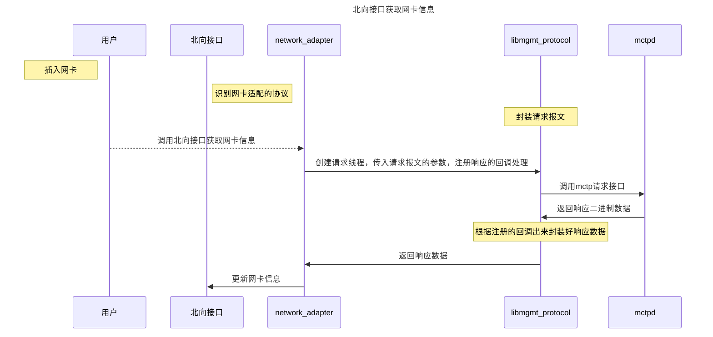

*openUBMC PCIe网卡适配功能详细设计说明书*

<table>
    <tr>
        <td>所属SIG组:</td>
        <td>hardware</td>
    </tr>
    <tr>
        <td>落入版本:</td>
        <td>25.12</td>
    </tr>
    <tr>
        <td>设计人员:</td>
        <td>周子彦</td>
    </tr>
    <tr>
        <td>日期:</td>
        <td>2025/11/10</td>
    </tr>
</table>

**Copyright © 2025 openUBMC Community**

您对"本文档"的复制，使用，修改及分发受木兰宽松许可证, 第2版协议(以下简称"MulanPSL2")的约束。
为了方便用户理解，您可以通过访问<https://license.coscl.org.cn/MulanPSL2>了解MulanPSL2的概要 (但不是替代)。
MulanPSL2的完整协议内容您可以访问如下网址获取：<https://license.coscl.org.cn/MulanPSL2>。

**改版记录**

<table>
    <tbody><tr>
        <th>日期</th>
        <th>修订版本</th>
        <th>修订描述</th>
        <th>作者</th>
        <th>审核</th>
    </tr>
    <tr>
        <td>2025/11/10</td>
        <td>1.0</td>
        <td>初始版本</td>
        <td>周子彦</td>
        <td>N/A</td>
    </tr>
</tbody></table>

**List of abbreviations**  **缩略语清单** ：

<table>
    <tr>
        <th>Abbreviations 缩略语</th>
        <th>Full spelling 英文全名</th>
        <th>Chinese explanation 中文解释</th>
    </tr>
    <tr>
        <td>VPD</td>
        <td>vital product data</td>
        <td>重要产品数据</td>
    </tr>
</table>

\[TOC]

# 1.功能分析

## 1.1 功能背景

<!-- 描述该需求的来源或背景，比如：支撑XXX功能、XXX优化等；以及该需求对用户（含组件）带来什么具体价值，如果没有该需求，对用户（含组件）带来什么损失； -->

适配以下网卡：E810XXVDA4G2P5, QLE2692， QLE2690，支持带内外获取网卡信息。

## 1.2 功能描述

<!-- 描述该需求交付的整体功能，主要实现XXX功能，解决XXX问题，明确方案如何实现 -->

在VPD组件中新增这些网卡的sr配置文件，实现BMC对网卡的带外访问，功能包括如下信息：

1、支持网卡的通用功能适配；

2、支持从带外获取网卡的信息并在北向web、redfish、snmp、cli接口显示；

3、告警配置验证;

4、传感器配置验证;

5、支持过温调速，按照同类网卡调速，仅支持调速策略生效，无需热设计;

## 1.3 功能场景

<!-- 描述该需求的业务使用场景，内容包括：
1) 场景出发条件及对象：什么角色/工具/接口等在什么具体情况下使用该特性，使用对象技能如何？
2) 使用时间及频度
3) 描述该特性主要有哪些场景、子场景及关键任务操作 -->

BMC用户可通过北向web、redfish、snmp、cli接口访问bmc获取网卡信息

## 1.4 功能列表

<!-- 描述该需求交付的功能列表，内容包括：列出功能详细描述，标题、描述。 -->

| 功能编号 | 功能标题   | 功能描述                                       |
| ---- | ------ | ------------------------------------------ |
| 1    | 网卡信息获取 | 支持通过北向web、redfish、snmp、cli接口获取网卡的基本信息和端口信息 |
| 2    | 网卡告警   | 支持BMC在网卡的异常状态下产生告警信息                       |
| 3    | 网卡传感器  | 支持BMC传感器中可以获取网卡芯片温度和光模块温度                  |
| 4    | 网卡调速   | 支持BMC基于获取的网卡温度自动调速                         |

# 2.功能设计

## 2.1 总体方案分析

<!-- 描述该方案的总体设计（注：相关输出方案可同步刷新到各组件仓） -->

* 网卡适配信息

| 网卡名称           | 厂商     | 芯片厂商   | 芯片型号    | vid/did       | sub vid/did   | 网口速率    | 网卡类型     | 温感  | 支持调速 | 支持mctp | 支持ncsi(边带接口) | 支持光模块温度 | 带外获取光模块信息 |
| -------------- | ------ | ------ | ------- | ------------- | ------------- | ------- | -------- | --- | ---- | ------ | ------------ | ------- | --------- |
| E810XXVDA4G2P5 | Intel  | Intel  | E810    | 0x8086/0x1593 | 0x8086/0x0005 | 4\*25GE | Ethernet | N/A | Y    | Y      | N            | N       | N         |
| QLE2692-HUA-SP | Qlogic | Qlogic | QLE2692 | 0x1077/0x2261 | 0x1077/0x029c | 2\*16GE | FC       | N/A | Y    | Y      | N            | N       | N         |
| QLE2690        | Qlogic | Qlogic | QLE2690 | 0x1077/0x2261 | 0x1077/0x029b | 1\*16GE | FC       | N/A | Y    | Y      | N            | N       | N         |

* 带外信息支持列表
  QLE2690、QLE2692：

1. 网口wwnn/wwpn、LinkStatus、LinkSpeed
2. 网卡芯片温度
3. 网卡FW版本、PN、SN

E810XXVDA4G2P5：

1. 网口LinkStatus、LinkSpeed、FullDuplex、PortMetrics(Redfish光模块接口中的RXFCSErrors)
2. 网口MAC地址，永久MAC地址
3. 网卡芯片温度
4. 网卡FW版本

### 2.1.1 方案详细设计

#### 2.1.1.1 方案概述

<!-- 描述该方案的整体实现，内容包括：涉及的关键点，实现策略等 -->

参照网卡配置指南进行csr的配置

#### 2.1.1.2 开发视图

<!-- 开发视图面向系统开发及软件管理，描述系统代码结构，构建结构的视图，主要解决系统技术实现和开发的问题，它依托逻辑视图，描述代码、构建结构 -->

不涉及

#### 2.1.1.3 运行视图

<!-- 运行视图面向系统运行，描述系统启动过程、运行期交互的视图，主要解决系统运行期交互，描述各可执行交付件在运行期的交互关系 -->

### 2.1.2 内部依赖分析

<!-- 是否涉及与其他组件接口依赖，如果涉及需要确认当前是否已完成，是否匹配当前需求开发诉求 -->

带外协议依赖network\_adapter组件

### 2.1.3 外部依赖分析

<!-- 是否涉及与平台SDK的依赖关系 -->

不涉及

### 2.1.4 北向接口分析

<!-- 需要分析当前功能是否有以下接口影响，如果有影响，则需要具体的补充影响点。其中注意点如下：
（1）如果有新增IPMI接口，请排查代码中IPMI命令注册的过滤字段，是否完全和IPMI命令的定义一致？
（2）新增一个接口时，需要咨询SIG组是否还有其他的接口受影响 -->

| 特性      | SNMP | CLI | WEB | KVM\_VMM | IPMI(RMCP/RMCP+) | HMM | Redfish |
| ------- | ---- | --- | --- | -------- | ---------------- | --- | ------- |
| 网卡兼容性适配 | Y    | Y   | Y   | NA       | NA               | NA  | Y       |

### 2.1.5 兼容性分析

<!-- 当前的功能对现有在网的功能是否有影响，具体的影响点进行分析之后输出影响分析表格 -->

不涉及

### 2.1.6 定制化接口分析

<!-- 如果支持定制化设置，则需要给出定制化时的默认值（空定制化项条件下的设置值），如果涉及到定制化接口变更或新增，注意定制化接口文档需配套修改。注意定制化默认值变更对白牌包的影响 -->

不涉及

### 2.1.7 导入导出分析

<!-- 如果支持导入导出的配置，则需要分析导入导出的schema。 -->

不涉及

### 2.1.8 传感器分析

<!-- 如果需要新增传感器，则需要提前登记和评审新增的传感器要素。新增传感器评审需要上SIG-Interface进行评审 -->

* 新增PCIe NIC(x) Temp 传感器获取网卡芯片温度，超过105℃时产生告警

注：(x)表示pcie槽位号

### 2.1.9 精准告警事件分析

<!-- 如果需要新增事件，则需要提前登记和评审新增的时间要素 -->

| 事件编号 | 事件类型    | 事件对象                                                                                    |
| ---- | ------- | --------------------------------------------------------------------------------------- |
| 1    | 基本事件    | Event\_PCIeBandWidth、Event\_PCIeLinkSpeed、Event\_PCIeCardUCE、Event\_PcieCardReplaceMntr |
| 2    | 温度相关事件  | Event\_OverTemp、Event\_TempFail                                                         |
| 3    | 网口相关事件  | Event\_Port1LinkDown、Event\_Port1BWUsageMntr （每个网口对应一组）                                 |
| 4    | 光模块相关事件 | Event\_OM1PowerAlarm、Event\_OM1SpeedMatch、Event\_OM1VAMntr    （每个网口对应一组）                |

### 2.1.10 系统锁定分析

<!-- 对外的接口或者命令是否支持系统锁定 -->

不涉及

### 2.1.11 用例场景分析

<!-- 以表格的形式输出该需求涉及的用例场景 -->

| 用例编号 | 用例名称                              | 测试步骤                                                                                                                                              | 用例预期                          |
| ---- | --------------------------------- | ------------------------------------------------------------------------------------------------------------------------------------------------- | ----------------------------- |
| 1    | redfish接口查询网卡信息测试                 | redfish接口查询网卡属性信息:（<https://ip/redfish/v1/Chassis/1/NetworkAdapters/XX）>                                                                          | 请求发送成功，响应码为200，响应体信息和带内网卡信息一致 |
| 2    | redfish接口查询网卡端口属性信息测试             | redfish接口查询网卡端口属性信息:（<https://ip/redfish/v1/Chassis/1/NetworkAdapters/XX/NetworkPorts/XX）>                                                        | 请求发送成功，响应码为200，响应体信息和带内网卡信息一致 |
| 3    | redfish接口查询网卡端口属性中网络信息信息测试        | redfish接口查询网卡端口属性中网络信息信息：(<https://ip/redfish/v1/Systems/1/EthernetInterfaces/XXXPortX>)                                                          | 请求发送成功，响应码为200，响应体信息和带内网卡信息一致 |
| 4    | cli接口查询PCIE 网卡信息测试                | cli接口查询PCIE Card INFO信息：ipmcget -d v    中的PCIE Card INFO信息                                                                                        | 命令获取信息与动态获取信息一致               |
| 5    | cli接口查询网卡端口MAC信息测试                | cli接口查询网卡端口MAC信息（命令：ipmcget -d mac）                                                                                                               | 命令获取信息与动态获取信息一致               |
| 6    | SNMP查询PCIE 网卡pCIeDeviceProperty信息 | 通过SNMP在节点pCIeDeviceProperty查询部件信息(snmpwalk -v2c -c `<password>` -m  +HUAWEI-SERVER-iBMC-MIB `<IP>` pCIeDeviceProperty)                            | snmp节点获取信息与其他接口信息一致           |
| 7    | SNMP查询网卡businessPortProperty信息    | 通过SNMP在节点businessPortProperty查询部件信息(snmpwalk -v2c -c `<password>` -m  +HUAWEI-SERVER-iBMC-MIB `<IP>` businessPortProperty)                        | snmp节点获取信息与其他接口信息一致           |
| 8    | SNMP查询网卡netCardProperty信息         | 通过SNMP在节点netCardProperty查询部件信息(snmpwalk -v2c -c `<password>` -m  +HUAWEI-SERVER-iBMC-MIB `<IP>` netCardProperty)                                  | snmp节点获取信息与其他接口信息一致           |
| 9    | SNMP查询网卡componentProperty信息       | 通过SNMP在节点componentProperty查询部件信息(snmpwalk -v2c -c `<password>` -m  +HUAWEI-SERVER-iBMC-MIB `<IP>` componentProperty)                              | snmp节点获取信息与其他接口信息一致           |
| 10   | web接口查询网卡端口属性信息测试                 | web接口查询网卡端口属性信息： 系统管理  -- 系统信息  -- 网络适配器                                                                                                          | 网页界面有网卡信息，与带内信息获取一致           |
| 11   | web接口查询PCIe卡信息测试                  | web接口查询PCIe卡信息测试：系统管理 -- 系统信息 -- 其他                                                                                                               | 网页界面有PCIe信息，与带内信息获取一致         |
| 12   | 网卡芯片和光模块传感器的测试                    | 通过cli、redfish、web等接口获取温度值(ipmcget -t sensor -d list,https\://device\_ip/redfish/v1/Chassis/1/ThresholdSensors,sensorProperty节点,系统管理--系统信息--门限传感器) | 各接口获取温感值一致                    |
| 13   | 事件告警测试                            | 通过ipmcset -t precisealarm -d mock -v 事件码 assert模拟触发告警，传感器告警通过设置关联对象的温度属性触发                                                                        | 告警能够正常触发并且能够解除                |
| 14   | 散热调速测试                            | 通过mdbctl setprop 相应传感器reading关联的属性值来模拟温度变化，触发调速                                                                                                   | 能够正常触发相应的调速                   |

## 2.2 非功能质量属性设计

### 2.2.1 扩展性分析

<!-- 考虑后续新增类似功能可以很好地扩展 -->

不涉及

### 2.2.2 重用性分析

<!-- 是否为通用处理方式、接口，如果是得考虑重用性 -->

不涉及

### 2.2.3 可测试性分析

<!-- 此需求如何验证，是否可直接验证，or通过XXX功能覆盖验证，or需要单独怎加测试接口验证 -->

### 2.2.4 资料分析

<!-- 是否涉及资料修改 -->

需刷新兼容性列表

### 2.2.5 资源使用分析

<!-- 新增线程、内存分配、模型属性名长度是否合理，CPU占用率是否会激增，Flash中新增文件是否合理（频繁读写Flash会大幅缩短emmc寿命）；是否涉及消息队列，如果涉及请检查是否存在某些场景下消息队列会满导致消息丢失，例如大量消息发送到队列且处理消息需要耗费较长时间的场景。 -->

不涉及

### 2.2.6 可靠性分析

| 编号 | 场景      | 问题描述            | 可靠性影响 | 问题级别 | 建议解决方案/需求 | 讨论结果 | 跟踪人 | 备注     |
| -- | ------- | --------------- | ----- | ---- | --------- | ---- | --- | ------ |
| 1  | DC场景    | DC前后信息是否保持一致    | 保持一致  | 一般   | 框架支持      | 支持   | 无   |   |
| 2  | AC场景    | AC前后信息是否保持一致    | 保持一致  | 一般   | 框架支持      | 支持   | 无   |   |
| 3  | BMC复位场景 | BMC复位前后信息是否保持一致 | 保持一致  | 一般   | 框架支持      | 支持   | 无   |   |
| 4  | 服务重启    | 服务重启前后信息是否保持一致  | 保持一致  | 一般   | 框架支持      | 支持   | 无   |   |

### 2.2.7 安全性分析

| 安全合规项                             | 是否涉及 | 现有的防护措施 |
| --------------------------------- | ---- | ------- |
| 访问控制（通道、文件权限、用户权限、查询权限、配置权限、接口权限） | 不涉及  | N/A     |
| 敏感数据                              | 不涉及  | N/A     |
| 日志（操作日志、维护日志、安全日志、运行日志）           | 不涉及  | N/A     |
| 文档                                | 不涉及  | N/A     |
| 加密及算法                             | 不涉及  | N/A     |
| 新增关键资源（密钥、证书、关键配置）备份、恢复           | 不涉及  | N/A     |
| 新增对外接口入参校验                        | 不涉及  | N/A     |
| 新增开源及三方软件引入                       | 不涉及  | N/A     |

# 3.功能实现

<!-- 通过表格、流程图、简明文字描述提供，力求容易看懂、容易实现，详细描述细节。 -->

## 3.1 适配带外获取网卡信息的功能实现

### 3.1.1 功能实现设计

* 网卡基础信息

* 网卡事件的监控配置

* 网卡传感器配置

* 网卡自动调速配置

### 3.1.2 功能详细设计

* 基础信息配置

  * 配置正确的文件名称，根据BOM+四元组信息组成对应网卡的文件名

  * 填写网卡名称、型号，类型，厂商和设备ID等(PCIeCard\_1, NetworkAdapter\_1)

  * 配置网卡端口数量，类型，光模块关联端口(NetworkPort\_XXX, OpticalModule\_XXX)

* 网卡事件的监控配置

  * 配置网卡涉及的端口对象(Event\_XXX)

* 网卡传感器配置

  * 配置网卡芯片传感器(ThresholdSensor\_Temp)（支持则配置，不支持则无）

  * 配置网卡光模块传感器(ThresholdSensor\_OpticalModuleTemp)（支持则配置，不支持则无）

* 网卡自动调速配置

  * 配置散热控制对象(CoolingRequirement\_XXX)，目标温度和满转温度E810按照85，90来进行测试验证, QLE2690/QLE2692按照90，102测试，失效调速值均为80，关联对象NetworkAdapter\_1.TemperatureCelsius

  注：散热策略根据具体机器的热设计需要自行修改，这里只做散热策略生效的验证。

### 3.1.3 开发者测试

<!--
增加模块接口：以活动图/流程图等形式明确模块内处理流程，针对模块处理流程中的分支进行覆盖
修改模块接口处理流程：覆盖修改影响流程分支
-->

#### 3.1.3.1 单元测试

不涉及

<!-- UT，主要是功能单元测试，测试对象是功能单元接口。UT测试设计要从黑盒（功能）角度设计，从输入(I)、处理（B）、预期输出（O）的角度进行用例分析设计，测试覆盖率仅作为反馈，用于分析哪些功能场景没有覆盖到，从而指导测试设计优化并补充测试用例 -->

#### 3.1.3.2 集成测试

不涉及

<!-- IT，主要是组件/模块内的集成测试，测试对象是模块/组件接口。IT测试设计将模块/组件当作黑盒测试，IT测试用例中禁止对组件/模块内部代码打桩，如果确实有少量场景难以构造，可以考虑在测试框架中统一打桩并提供接口供测试用例调用构造场景。
说明：API测试属于IT，其测试对象是微服务接口。
PCST，是指PC上的服务集成测试，测试对象是功能需求。PCST测试设计，要覆盖正常功能、异常功能和交叉功能，采用灰盒 -->
