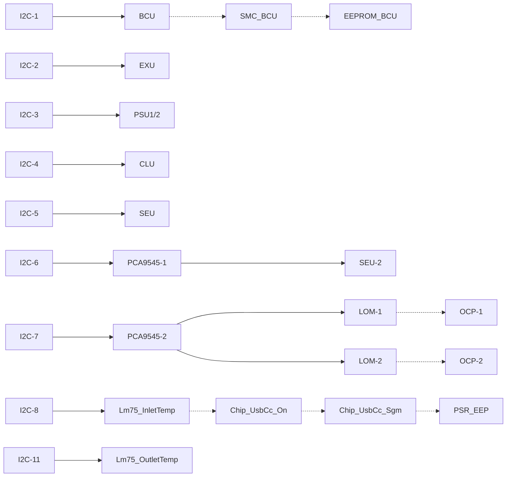

# Kunpeng 系列化硬件平台

# IIC拓扑图

```mermaid
graph LR
    I2C-1 ---> BCU -.-> SMC_BCU -.-> EEPROM_BCU
    I2C-2 ---> EXU
    I2C-3 ---> PSU1/2
    I2C-4 ---> CLU
    I2C-5 ---> SEU
    I2C-6 ---> PCA9545-1 ---> SEU-2
    I2C-7 ---> PCA9545-2
        PCA9545-2 ---> LOM-1 -.-> OCP-1
        PCA9545-2 ---> LOM-2 -.-> OCP-2
    I2C-8 ---> Lm75_InletTemp -.-> Chip_UsbCc_On -.-> Chip_UsbCc_Sgm -.-> PSR_EEP
    I2C-11 ---> Lm75_OutletTemp
```