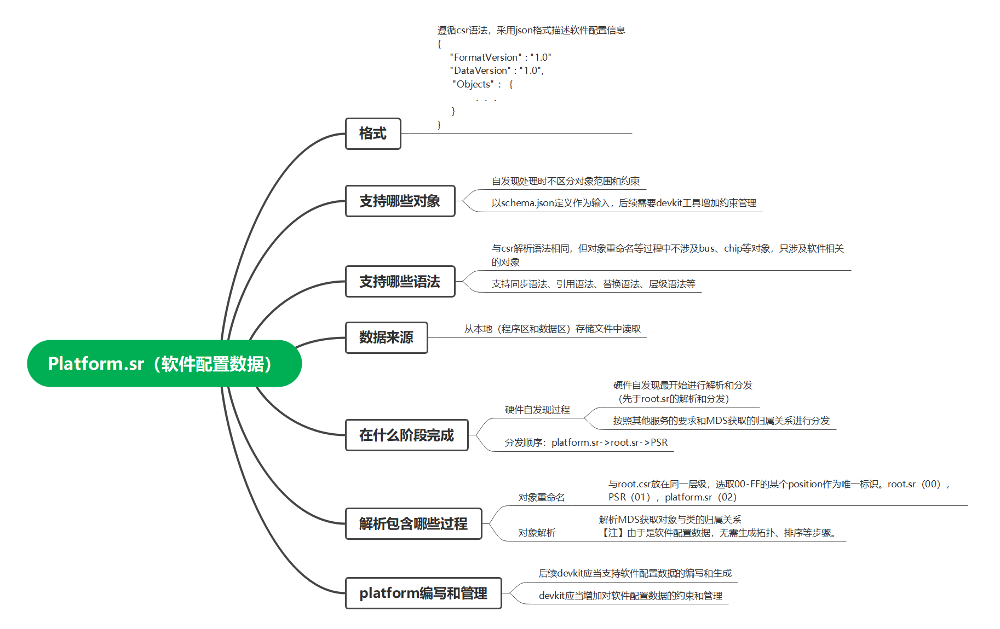

# platform 整机软件配置
platform.sr中存放与硬件无任何关联的纯软件配置数据。具体格式规范和细节如下图所示。

# 以下描述本产品SerialManagement对象的ID分配情况，需要注意避免重复
ID  | Source    | Destination | Location         | Note
----------------------------------------------------------------------
0   | PANEL COM | SYS COM     | platform.sr      | 
1   | PANEL COM | BMC COM     | platform.sr      |
2   | SOL COM   | SYS COM     | platform.sr      |
3   | SOL COM   | BMC COM     | platform.sr      |
4   | SOL COM   | CARD COM    | 14140130_xxx.sr  | 本产品为外接卡仅预留了1个串口座子
5   | UART4     | CARD COM    | 14140130_xxx.sr  | 用于外接卡的串口录音功能
6   | SYS COM   | BMC COM     | platform.sr      |
254 | PANEL COM | CLOSE       | platform.sr      |